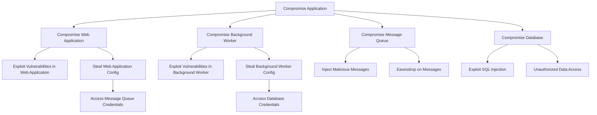

```mermaid
    graph TD
        root["Compromise Application"]
        webapp["Compromise Web Application"]
        root --> webapp
        webapp1["Exploit Vulnerabilities in Web Application"]
        webapp --> webapp1
        webapp2["Steal Web Application Config"]
        webapp --> webapp2
        webapp2-1["Access Message Queue Credentials"]
        webapp2 --> webapp2-1
        bgworker["Compromise Background Worker"]
        root --> bgworker
        bgworker1["Exploit Vulnerabilities in Background Worker"]
        bgworker --> bgworker1
        bgworker2["Steal Background Worker Config"]
        bgworker --> bgworker2
        bgworker2-1["Access Database Credentials"]
        bgworker2 --> bgworker2-1
        msgqueue["Compromise Message Queue"]
        root --> msgqueue
        msgqueue1["Inject Malicious Messages"]
        msgqueue --> msgqueue1
        msgqueue2["Eavesdrop on Messages"]
        msgqueue --> msgqueue2
        database["Compromise Database"]
        root --> database
        database1["Exploit SQL Injection"]
        database --> database1
        database2["Unauthorized Data Access"]
        database --> database2
```